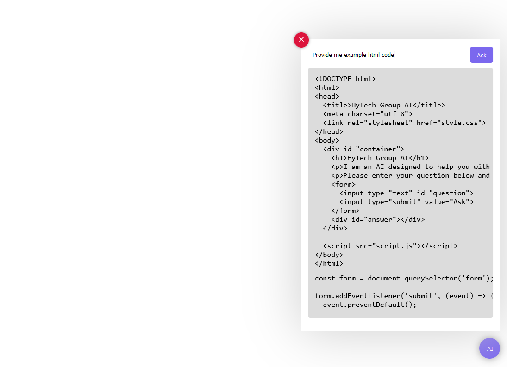

# Modules Floating Chat GPT AI (Gemini) for React



ReactJS modules are simple but have many advantages, one of which is that you can customize them freely.

## NPM Installation
```sh
npm i hytech-component
npm i @google/generative-ai
npm i react-markdown
```

## Import Modules
```sh
import GeminiAI,{ ButtonGpt, CloseButtonGpt, FormInputGpt, MessageGpt } from "hytech-component/GeminiAI";
import Markdown from 'react-markdown';
```
## Setup Config
```sh
  const apiKey = 'Your apiKey'; // Use your GeminiAI Api here
  const command = 'You have to pretend to be a AI for HyTech Group';
  const aiModel = 'gemini-pro';
  const {
    showBoxAI,
    toggleBox,
    loading,
    response,
    message,
    setMessage,
    handleSubmit,
  } = GeminiAI(apiKey, command, aiModel);
```

## Implementation Component
```sh
<div>
  <ButtonGpt className="float-button" onClick={toggleBox}>AI</ButtonGpt>
  {showBoxAI && (
    <div className="card">
      <CloseButtonGpt className="close" onClick={toggleBox}>
        <svg xmlns="http://www.w3.org/2000/svg" width="18" height="18" fill="currentColor" viewBox="0 0 24 24"><path d="M19 6.41L17.59 5 12 10.59 6.41 5 5 6.41 10.59 12 5 17.59 6.41 19 12 13.41 17.59 19 19 17.59 13.41 12z"/></svg>
      </CloseButtonGpt>
      <FormInputGpt className="input-section" handleSubmit={handleSubmit}>
        <input type="text" value={message} onChange={(e) => setMessage(e.target.value)} />
        <ButtonGpt>Ask</ButtonGpt>
      </FormInputGpt>
      <div className="message-section">
        {loading ? 
          <MessageGpt>
            Loading ...
          </MessageGpt> : <MessageGpt>
            <Markdown>{String(response)}</Markdown>
          </MessageGpt>
        }
      </div>
    </div>
  )}
</div>
```

## Full Code App.js

```sh
import React from "react";
import GeminiAI,{ ButtonGpt, CloseButtonGpt, FormInputGpt, MessageGpt } from "hytech-component/GeminiAI";
import Markdown from 'react-markdown';

function App() {
  const apiKey = 'Your apiKey'; // Use your GeminiAI Api here
  const command = 'You have to pretend to be a AI for HyTech Group';
  const aiModel = 'gemini-pro';
  const {
    showBoxAI,
    toggleBox,
    loading,
    response,
    message,
    setMessage,
    handleSubmit,
  } = GeminiAI(apiKey, command, aiModel);

  return (
    <div>
      <ButtonGpt className="float-button" onClick={toggleBox}>AI</ButtonGpt>
      {showBoxAI && (
        <div className="card">
          <CloseButtonGpt className="close" onClick={toggleBox}>
            <svg xmlns="http://www.w3.org/2000/svg" width="18" height="18" fill="currentColor" viewBox="0 0 24 24"><path d="M19 6.41L17.59 5 12 10.59 6.41 5 5 6.41 10.59 12 5 17.59 6.41 19 12 13.41 17.59 19 19 17.59 13.41 12z"/></svg>
          </CloseButtonGpt>
          <FormInputGpt className="input-section" handleSubmit={handleSubmit}>
            <input
              type="text"
              value={message}
              onChange={(e) => setMessage(e.target.value)}
            />
            <ButtonGpt>
              Ask
            </ButtonGpt>
          </FormInputGpt>
          <div className="message-section">
            {loading ? 
            <MessageGpt>
              Loading ...
            </MessageGpt> : <MessageGpt>
              <Markdown>{String(response)}</Markdown>
            </MessageGpt>
            }
          </div>
        </div>
      )}
    </div>
  );
}

export default App;
```

## Get ApiKey
Go to : <a href="https://makersuite.google.com/">HERE</a>

<p>Official Site: <a href="https://hy-tech.my.id/docs">HyTech Group</a></p>
